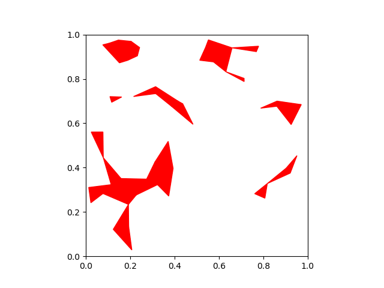

Implementation of the IRIS algorithm from [*Computing Large Convex Regions of Obstacle-Free Space Through Semidefinite Programming*](https://link.springer.com/chapter/10.1007/978-3-319-16595-0_7) (Robin Deits and Russ Tedrake) for a simple, randomly-generated 2D world. The edges have been identified (as in the retro arcade game "Asteroids"), making the world toroidal in nature.

After running the program, click a point in free space to generate an obstacle-free convex region.

